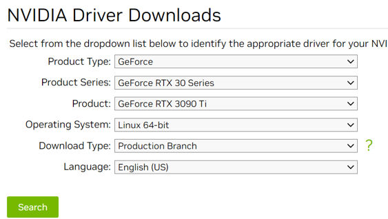
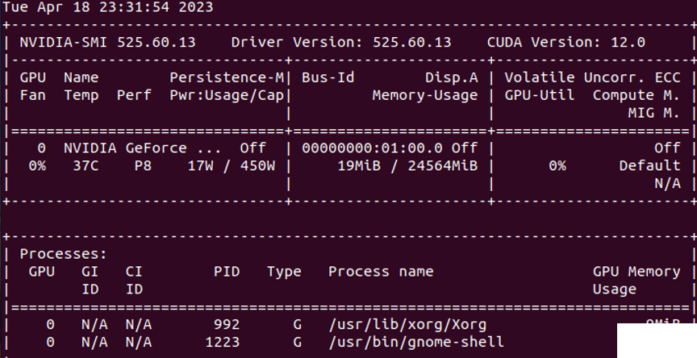
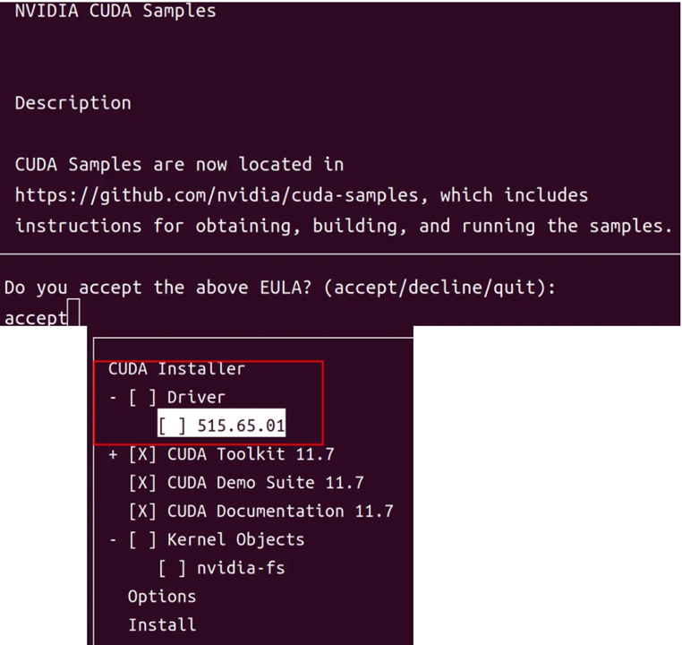
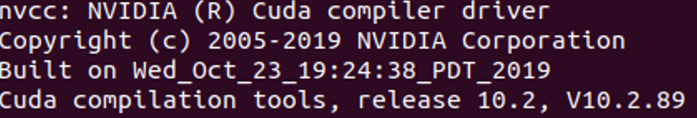
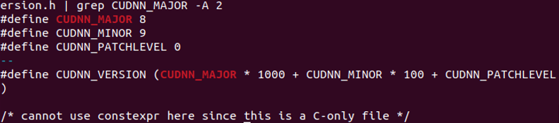

# Ubuntu上NVIDIA的驱动安装，CUDA安装，CuDNN安装的总结
- 随着深度学习的流行，越来越多的新模型不断出现，而这些新模型大多数都是在Ubuntu之类的Linux系统上运行。所以我已经装了无数次Ubuntu系统，和对应的Driver。每次装的时候都要在网上搜来搜去很麻烦，所以我就自己写了一个。

- 然后我也写了一些在Ubuntu上必备的软件，方便开发！[Ubuntu的常用工作软件](xxx).


## 1.首先是新电脑的情况下。
- 我买了一台新电脑，插上了单独买的显卡，用[Ubuntu的系统的安装参考](https://ubuntu.com/tutorials/install-ubuntu-desktop#1-overview),说的USB来创建启动盘，然后安装官方的指示一步一步的安装好了Ubuntu的系统。然后发现下面图的样子，为什么没有NVIDIA? 这是因为电脑里面还有集成显卡，要设置才能切换到NVIDAI的独立显卡上。


- 你要做的事是```F2```或者```Delete```或者```F12```进入到```BIOS```，将```Boot OS Type```改成：```Other OS---> standard```或者```secure boot control ```设置为```disabled```。如图所示。


## 2. NVIDIA的显卡驱动安装
```bash
# 先看看你的显卡型号
$ lspci | grep -i nvidia
```
- 然后去[NVIDIA驱动官网](https://www.nvidia.com/download/index.aspx ).如图所示找到自己的显卡型号，操作的系统。建议找到```.run```文件下载到本地进行安装。



- 重要！如果你直接安装就会得到下面的错误
```bash
PATH: /usr/local/sbin:/usr/local/bin:/usr/sbin:/usr/bin:/sbin:/bin:/usr/games

nvidia-installer command line:
    ./nvidia-installer

Using: nvidia-installer ncurses user interface
-> The file '/tmp/.X0-lock' exists and appears to contain the process ID '1062' of a >runnning X server.
ERROR: You appear to be running an X server; please exit X before installing.  For >further details, please see the section INSTALLING THE NVIDIA DRIVER in the README >available on the Linux driver download page at www.nvidia.com.
ERROR: Installation has failed.  Please see the file '/var/log/nvidia-installer.log' >for details.  You may find suggestions on fixing installation problems in the README >available on the Linux driver download page at www.nvidia.com.
```

- 你需要做的事情如下！请一定要做，因为如果不提前关闭电脑的图形程序，就会导致安装失败。我想大多数的不能安装都是出现在这一步骤。

- 请按下面的顺序执行
```bash
1.按Ctrl+Alt+F1并使用你的账号登录。
2.通过输入 sudo service lightdm stop 或 sudo lightdm stop 来结束你当前的X server会话。
3.通过输入 sudo init 3 进入第三运行级别。
# 安装你的 *.run 文件。
4.通过输入 cd Downloads 改变到你下载文件的目录。如果它在另一个目录，就去那里。当你输入 ls NVIDIA* 时，查看是否可以看到该文件。
5.使用 chmod +x ./your-nvidia-file.run 使文件可执行。
6.使用 sudo ./your-nvidia-file.run 执行该文件。
7.安装完成后，你可能需要重启。如果不需要，运行 sudo service lightdm start 或 sudo start lightdm 以再次启动你的X server。此外在每次内核更新后，你都需要重复上述步骤。
```

- 如果顺利的话```nvidia-smi```就会得到下面的结果，到此你的nvidia driver就安装完成了。



## 3. Cuda的安装
- [CUDA安装官方访问](https://developer.nvidia.com/cuda-toolkit-archive)，找到和你匹配的Cuda, 注意如果要用```Pytorch```的话请选11.7以下的，截止到202310左右，如果更新最新的```Pytorch```的版本会导致很多OSS不能成功运行。
```bash
# 下载完毕后安装
$ chmod +x ./your-cuda-file.run
$ sudo sh cuda_12.0.0_525.60.13_linux.run
```
- 入下图所示安装成功


- 然后进行Cuda环境变量的追加
```bash
$ export PATH=$PATH:/usr/local/cuda-12.0/bin
# add cuBLAS, cuSPARSE, cuRAND, cuSOLVER, cuFFT to path
$ export　LD_LIBRARY_PATH=$LD_LIBRARY_PATH:/usr/local/cuda-12.0/lib64:/usr/lib/x86_64-linux-gnu
$ source ~/.bashrc
```

- 最后在```terminal```中输入```nvcc -V```有结果的话，代表成功



## 4. CuDNN (CUDA Deep neural network library) 专门用于加速深度学习的软件

- [Nvidia官网](https://developer.nvidia.com/cudnn),需要账号。然后根据自己的cuda版本进行下载。

```bash
# 按顺序执行就好了，注意path正确，请仔细看cuda和你的版本是否匹配
$ cd /usr/local/cuda-12.0 
$ sudo chmod 666 include
$ tar -xvf cudnn-linux-x86_64-8.9.0.131_cuda12-archive.tar.xz 
$ tar -xvf cudnn-linux-x86_64-8.9.0.131_cuda12-archive.tar.xz 
$ sudo cp cudnn-*-archive/include/cudnn*.h /usr/local/cuda-12.0/include 
$ sudo cp cudnn-*-archive/lib/libcudnn* /usr/local/cuda-12.0/lib64 
$ sudo chmod a+r /usr/local/cuda/include/cudnn*.h /usr/local/cuda-12.0/lib64/libcudnn*
```

- 最后```$ sudo cat /usr/local/cuda-12.0/include/cudnn_version.h | grep CUDNN_MAJOR -A 2```
可以得到下面的结果就算成功啦



## 这样就算成功啦，基本上关于nvidia的东西都是可以运行的。

### 快速 Accesss
- [🐧 Ubuntu 的 NVIDIA 安装](https://github.com/Leozyc-waseda/TechMemoirsOfLeo/blob/main/Ubuntu_NVIDIA_CUDA_INSTALL.md)
- [🚀 Slowfast 的环境安装](https://github.com/Leozyc-waseda/TechMemoirsOfLeo/blob/main/slowfast_install_2023_leo.md)
- [🎥 Slowfast 的 Kinetics-400 数据集训练调试成功](./Slowfast_kinetics-400.md)
- [📊 Slowfast 训练自己的数据集](./Train_your_ownDataset_Slowfast.md) 
- [💼 Ubuntu 的常用工作软件](./Ubuntu_Remote_Software.md) 
