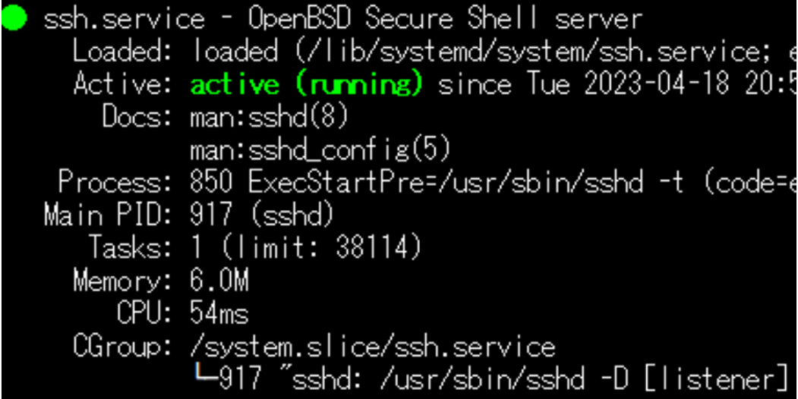
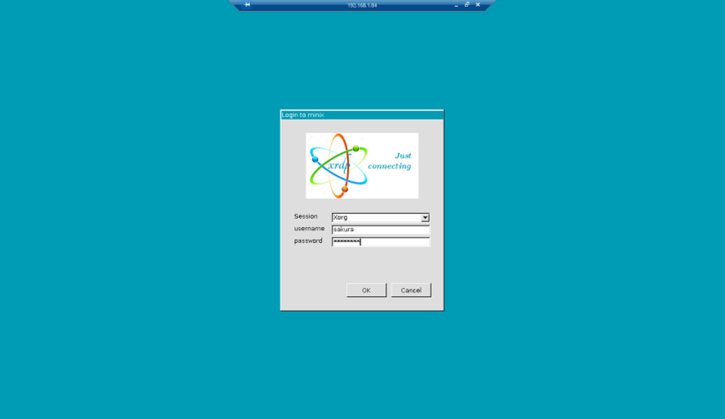

<h1 align="center">Ubuntu 远程操作的时候经常用的软件的总结</h1>
<p align="center">
  <strong>使用这个指南，帮助你高效地从Windows远程连接至Ubuntu。</strong>
</p>

## 📝 为什么写这个总结？

> 写这个readme是因为，一般在公司的时候，都是通过一台性能较弱的笔记本电脑，远程操作放在公司的大型主机。大型主机进行最主要的运算工作，比如说训练，计算，运行代码。而在自己的笔记本本地上进行代码的构建。我相信大多数的Software engineering都不是很想去公司吧。所以我总结了一些常用的windows连接ubuntu的远程必备软件，算是给自己一个Backup。


---

## 1️⃣ SSH (安全外壳协议)
SSH为网络服务提供安全的传输环境，常用于本地打开远程的代码进行操作。

- 推荐远程操作软件，```vscode``` or ```Tera Term```。其实Vscode就可以了。
```bash
# 安装步骤
$ sudo apt update​
$ sudo apt install openssh-server​
#Firewall​
$ sudo ufw allow ssh​
$ sudo ufw status​
$ sudo /etc/init.d/ssh restart
```
- 最后在```teriminal```中输入```$ sudo systemctl status ssh​```显示下面的图片就是成功了。



## 2️⃣ Vscode 远程控制
- vscode是真的好用。

```bash
#首先在vscode中左下角的齿轮一样的图标中找到extensions,然后搜索remote-ssh download
1. vscode remote-ssh download

# ubuntu上运行ifconfig来找到ip地址
$ ifconifg

# 然后在windows上
2. windows cmd : ssh username@1xx.xxx.x.xxx
3. windows cmd : ssh-keygen -t rsa -b 4096
4. windows cmd : cat C:your\path\.ssh\id_rsa.pub

# 在ubuntu上
5. ubuntu pc: sudo nano  ~/.ssh/authorized_keys
6. vscode remote-configure: 
    Host 1xx.xxx.x.xxx
      HostName 1xx.xxx.x.xxx
      User username
      IdentityFile ~/.ssh/id_rsa
```
这样子连接ubuntu后不用每次都输入密码，而且可以使用vscode，在windows远程操作Ubuntu啦。

## 3️⃣ Samba
- samba是在windows上可以直接使用windows的文件夹浏览器去浏览Ubuntu的文件。
- 参考安装的网站[Ubuntu的官方给的](https://ubuntu.com/tutorials/install-and-configure-samba#1-overview)

```bash
$ sudo apt update
$ sudo apt install samba

# 配置 Samba
$ mkdir /home/<username>/sambashare/

$ sudo nano /etc/samba/smb.conf
At the bottom of the file, add the following lines:

[sambashare]
    comment = Samba on Ubuntu
    path = /home/username/sambashare
    read only = no
    browsable = yes

Then press Ctrl-O to save and Ctrl-X to exit from the nano text editor.
$ sudo service smbd restart
$ sudo ufw allow samba

# 设置samba的用户账户
$ sudo smbpasswd -a username

# 然后打开windows
win + r
\\your_ip_address
```

## 4️⃣ XRDP
- 对于不能使用```teamviewer```的人我觉得这个是最好用的。

- 照着安装就好

```bash
$ sudo apt update && sudo apt -y upgrade
$ sudo apt install -y xrdp
$ sudo apt install xorgxrdp
$ touch u_setting.sh
$ sudo nano u_setting.sh
```
- 然后```u_setting.sh```输入下面的内容
```bash
cat <<EOF > ~/.xsessionrc export GNOME_SHELL_SESSION_MODE=ubuntu 
export XDG_CURRENT_DESKTOP=ubuntu:GNOME
export XDG_DATA_DIRS=/usr/share/ubuntu:/usr/local/share:/usr/share:/var/lib/snapd/desktop 
export XDG_CONFIG_DIRS=/etc/xdg/xdg-ubuntu:/etc/xdg 
EOF
```

```bash
$ touch g_setting.sh
$ sudo nano g_setting.sh
```

- 然后```g_setting.sh```输入下面的内容
```bash
sudo sed -e 's/^new_cursors=true/new_cursors=false/g' -i /etc/xrdp/xrdp.ini

cat <<EOF | \
sudo tee /etc/polkit-1/localauthority/50-local.d/xrdp-color-manager.pkla
[Netowrkmanager]
Identity=unix-user:*
Action=org.freedesktop.color-manager.create-device
ResultAny=no
ResultInactive=no
ResultActive=yes
EOF

sudo systemctl restart xrdp
sudo systemctl restart polkit
```
- 然后分别执行这两个```.sh```文件
```bash
$ bash ./ u_setting.sh
$ bash ./ g_setting.sh
```
- 键盘和鼠标
```bash
$ sudo apt install xserver-xorg-core xorgxrdp xrdp
$ sudo apt install xserver-xorg-input-all

#上面不行的情况下
$ sudo apt-get update -y
$ sudo apt-get install -y xorgxrdp
```

最后打开windows上这个remote软件，输入id address，就可以看到下面的界面啦。



### 快速 Accesss
- [🐧 Ubuntu 的 NVIDIA 安装](https://github.com/Leozyc-waseda/TechMemoirsOfLeo/blob/main/Ubuntu_NVIDIA_CUDA_INSTALL.md)
- [🚀 Slowfast 的环境安装](https://github.com/Leozyc-waseda/TechMemoirsOfLeo/blob/main/slowfast_install_2023_leo.md)
- [🎥 Slowfast 的 Kinetics-400 数据集训练调试成功](./Slowfast_kinetics-400.md)
- [📊 Slowfast 训练自己的数据集](./Train_your_ownDataset_Slowfast.md) 
- [💼 Ubuntu 的常用工作软件](./Ubuntu_Remote_Software.md) 
