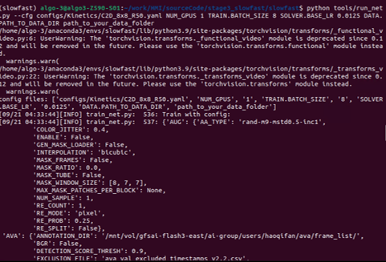
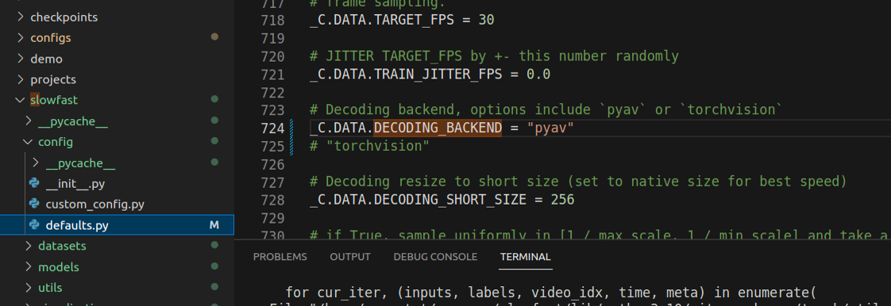

# Meta (Facebook AI) Slowfast 的环境构建总结
- 之所以写这个readme，是因为我发现在构建Slowfast的时候需要好多更改的东西才能运行。[官方​安装指示](https://github.com/facebookresearch/SlowFast/blob/main/INSTALL.md)的readme都是2年前的了，所以希望这篇构建可以帮助到其他朋友。

- 然后我也写了关于如何构建如何用Slowfast来训练自己的模型。[Slowfast的定制化​](xx).

- 安装前请确保NVIDIA Driver, CUDA以及CUDNN得到了正确的安装。如果没有安装请参考这[Ubuntu的NVIDIA的安装​](https://github.com/Leozyc-waseda/TechMemoirsOfLeo/blob/main/Ubuntu_NVIDIA_CUDA_INSTALL.md).最后```python nvidia-smi```和```python nvcc -V```都有结果的话一般就ok。


### 1. 新建一个全新的Python环境
```bash
# Anaconda的用户
$ conda create -n slowfast python=3.8

# 企业原因不能用Anaconda的用户
$ mkdir my_venv​
$ cd my_venv​
$ python3 -m venv​
$ python3 -m venv my_venv​
$ source my_venv/bin/activate​
```

### 2. Pytorch的安装，请根据[Pytorch​](https://pytorch.org/get-started/previous-versions/), command+F 找到自己的cuda version, 建议比较之前的，最新的有可能还有很多Open source software还没有对应。
```bash 
# 对我的PC来说
$ pip install torch==1.13.1+cu117 torchvision==0.14.1+cu117 torchaudio==0.13.1 --extra-index-url https://download.pytorch.org/whl/cu117
```
### [官方​安装指示](https://github.com/facebookresearch/SlowFast/blob/main/INSTALL.md)参考，然后安装
```bash
# fvcore
$ pip install 'git+https://github.com/facebookresearch/fvcore'
or
$ git clone https://github.com/facebookresearch/fvcore
$ cd fvcore
$ python setup.py install

# simplejson
$ pip install simplejson

# PyAV
$ conda install av -c conda-forge
or
$ pip install av

# iopath
$ pip install -U iopath 
or 
$ conda install -c iopath iopath

# psutil
$ pip install psutil

# OpenCV
$ pip install opencv-python

# tensorboard
$ pip install tensorboard

# moviepy
$ conda install -c conda-forge moviepy 
or 
$ pip install moviepy

# PyTorchVideo
$ pip install pytorchvideo
or
$ pip install "git+https://github.com/facebookresearch/pytorchvideo.git"

# FairScale
$ pip install 'git+https://github.com/facebookresearch/fairscale'

# cython
$ pip install -U torch torchvision cython

# Detectron2
$ git clone https://github.com/facebookresearch/detectron2 detectron2_repo
$ pip install -e detectron2_repo

# scipy
$ pip install scipy

# pandas    
$ pip install pandas

# scikit-learn   
$ pip install scikit-learn
```
- 有可能我的电脑以前转过的软件就自动跳过了，如果报错请参考terminal的输出然后挨个按照。

### 3.配置环境变量
```bash
$ sudo nano ~/.bashrc
$ export PYTHONPATH=/path/to/your/SlowFast/slowfast:$PYTHONPATH
$ source  ~/.bashrc
$ cd ./slowfast
$ python setup.py build develop

```

### 4. 运行测试程序，如果你很幸运，应该就可以得到下面的图片了。
```bash
$ python tools/run_net.py --cfg configs/Kinetics/C2D_8x8_R50.yaml NUM_GPUS 1 TRAIN.BATCH_SIZE 8 SOLVER.BASE_LR 0.0125 DATA.PATH_TO_DATA_DIR path_to_your_data_folder
```



### Toubleshooting

- 由于很多原因，比如我们只有一个GPU，Facebook的人用了8个GPU，以及他们的OSS版本很老导致一些OSS已经不能用之类的原因，所以我们要进行troubleshooting。下面只是我的电脑的情况，其他人可以参考一下，具体以自己的电脑的错误为准去Debug。

- ```SLOWFAST_8x8_R50.yaml```(注意用你需要的模型架构)，中的BATCH_SIZE: 12, NUM_GPUS: 1, NUM_WORKDERS

- ```probe_video_from_memory```或者```-Failed to decode by pyav with exception: unsupported operand type(s) for -: 'list' and 'int'```报错
[参考​](https://github.com/facebookresearch/SlowFast/issues/181#issuecomment-1179203872). 把code改成这个 [Pull request​](https://github.com/facebookresearch/SlowFast/pull/541/files).


- ```defaults.py```
```bash
# torchvision 改成pyav
_C.DATA.DECODING_BACKEND = "pyav"
```


### 如果你顺利，那就可以运行Slowfast啦~(参考4.)
- 如果需要用Kinetics-400来测试模型的性能，请参考[这篇笔记​](https://github.com/facebookresearch/SlowFast/pull/541/files)。由于Kinetics-400已经有很多失效的code，导致很难下完完整的文件，然后不能顺利的用Kinetics-400的数据集进行训练测试。

- 如果需要如何用Slowfast来训练自己的模型。[Slowfast的Kinetics-400数据集训练调试成功​](..).

### References, 参考安装的URL​


１．[阮喵喵的rmmv开发笔记​](https://www.ruan-cat.com/ruan-cat-own-notes/python/SlowFast/SlowFast.html).​

２．[官方​安装指示](https://github.com/facebookresearch/SlowFast/blob/main/INSTALL.md).​

